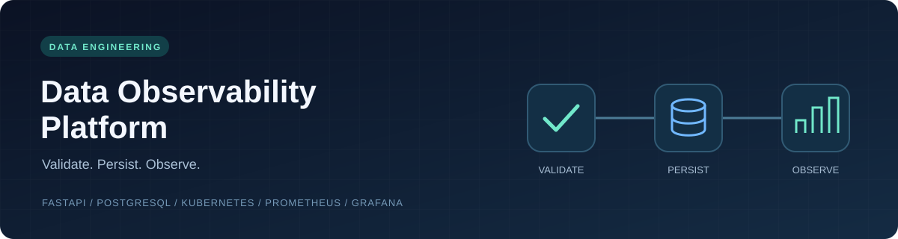
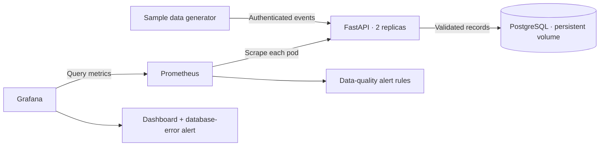

<p align="center">
  
</p>

<p align="center">
  <a href="https://github.com/BhavyaPatel0306/data-observability-platform/actions/workflows/ci.yml"></a>
  
  
  
  
</p>

<p align="center">
  <strong>Catch invalid data. Track freshness. See ingestion health.</strong><br />
  A Kubernetes portfolio project built with FastAPI, PostgreSQL, Prometheus, and Grafana.
</p>

<p align="center">
  <a href="docs/getting-started.md">Quick start</a> ·
  <a href="docs/api.md">API reference</a> ·
  <a href="docs/observability.md">Monitoring</a> ·
  <a href="VALIDATION.md">Validation status</a>
</p>

## Why this project

An API can be healthy while the data flowing through it is not. This project checks incoming events, stores accepted records, and exposes the signals needed to distinguish invalid submissions, duplicate events, stale data, and persistence failures.

It is a compact, inspectable implementation: one event contract, two API replicas, a persistent database, and monitoring provisioned from version-controlled files.

## What it does

- **Validates events:** UUIDs, source names, bounded numeric values, timezone-aware timestamps, and unexpected fields.
- **Persists reliably:** commits before acknowledging success and enforces event uniqueness across replicas in PostgreSQL.
- **Measures data quality:** counts acceptance, rejection, duplicates, database failures, and stale events; records latency and event age.
- **Runs on Kubernetes:** includes probes, resource limits, a schema initialization Job, persistent PostgreSQL storage, and namespace-scoped discovery permissions.
- **Makes failures visible:** provisions six Grafana panels, four Prometheus alert rules, and a Grafana-managed database-error alert.
- **Checks changes automatically:** includes application tests, PostgreSQL integration, Prometheus rule tests, and a Kind deployment smoke test in GitHub Actions.

## Architecture



Each API process owns its metrics. Prometheus discovers individual pods, so scaling the API does not hide counters behind a load-balanced scrape endpoint.

## Get running

With Docker, Minikube, kubectl, and Python 3.12 installed, run from the repository root:

```sh
minikube start --cpus=4 --memory=6144
minikube image build -t data-observability-api:local .
kubectl apply -f k8s/namespace.yaml
kubectl apply -f k8s/secret.example.yaml
kubectl apply -k .
kubectl -n data-observability wait --for=condition=complete job/init-db --timeout=240s
kubectl -n data-observability rollout status deployment/api --timeout=240s
```

Continue with the **[Minikube walkthrough](docs/getting-started.md)** to open the API and Grafana, send sample traffic, and verify monitoring. The example Secret contains public demo credentials for a local cluster only.

## Explore the demo

1. **Send clean traffic** with the generator's `--invalid-rate 0 --stale-rate 0` options.
2. **Introduce quality problems** with its default mix of invalid and stale events.
3. **Watch the dashboard** show outcomes, rejection percentage, stale events, p95 request latency, event age, and firing alerts.
4. **Inspect the API contract** and retrieve an accepted event by its UUID.

Allow several minutes for five-minute rate windows and alert pending periods. The repository includes dashboard configuration; it does not present fabricated runtime screenshots or performance claims.

## Repository map

```text
app/                  FastAPI service, validation, persistence, schema setup
k8s/                  Deployments, StatefulSet, Services, RBAC, example Secret
monitoring/           Prometheus configuration, Grafana provisioning, rule tests
scripts/              Sample data generator and monitoring smoke check
tests/                API behavior and configuration checks
docs/                 Setup, API, monitoring, development, operations
.github/              CI, dependency updates, issue and PR templates
Dockerfile            Non-root API container
kustomization.yaml    Kubernetes assembly and generated ConfigMaps
VALIDATION.md         What has actually been tested
```

## Development

```sh
python -m venv .venv
# Activate .venv for your shell, then:
python -m pip install -r requirements-dev.txt
python -m pytest -q
ruff check app tests scripts
```

See the [development guide](docs/development.md) for PostgreSQL integration and running the API directly. See [CONTRIBUTING.md](CONTRIBUTING.md) for the contribution workflow.

## Design boundaries

This is a portfolio demonstrator. It measures validity, freshness, duplicates, availability, and latency for one event schema. It does not implement lineage, arbitrary dataset profiling, or statistical drift detection.

PostgreSQL is persistent but has no failover or backups. Monitoring history is ephemeral. External alert delivery, TLS ingress, rate limiting, and tenant isolation are outside this demo's scope. Read the [operations guide](docs/operations.md) before adapting it for a shared environment.

The CI badge above reflects GitHub's actual workflow status. [VALIDATION.md](VALIDATION.md) distinguishes local checks from deployment checks.
